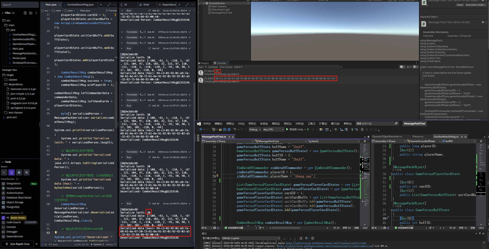

# JavaMsgPack-Utility

## Overview

The `Java MessagePack Serializer` is a custom serialization library designed to ensure compatibility between Java and C# MessagePack serialization formats. This library supports the serialization and deserialization of nested objects, lists, and maps. This makes it an ideal choice for projects requiring seamless data exchange between Java and C# applications.




## Features

- **Cross-Platform Compatibility**: Ensures serialized data in Java matches the format expected by C# and vice versa.
- **Handles Complex Data Structures**: Supports serialization and deserialization of nested objects, lists, and maps.
- **Nil Value Handling**: Gracefully manages null values in serialization and deserialization processes.

## Installation

Add the following dependency to your `pom.xml` if you're using Maven:

```xml
<dependency>
    <groupId>org.msgpack</groupId>
    <artifactId>msgpack-core</artifactId>
    <version>0.9.8</version>
</dependency>
```

For Gradle users, add the following to your build.gradle:
```gradle
implementation 'org.msgpack:msgpack-core:0.9.8'
```

## Usage

Java Class
```java
public class CombatResultMsg {
    public boolean success;
    public long winPlayerID;
    public SimDataOfCommander leftCommanderData;
    public List<GameVersusPlayerCardState> leftHandCards;
}
```
C# Class
```csharp
[MessagePackObject]
public class CombatResultMsg
{
    [Key(0)]
    public bool success;
    [Key(1)]
    public long winPlayerID;
    [Key(2)]
    public SimDataOfCommander leftCommanderData;
    [Key(3)]
    public List<GameVersusPlayerCardState> leftHandCards;
}
```

Serializing and Deserializing Objects
To serialize an object:

```java
CombatResultMsg msg = new CombatResultMsg();
// Populate msg fields
byte[] data = MessagePackSerializer.serialize(msg);
```
To deserialize an object:

```java
CombatResultMsg deserializedMsg = MessagePackSerializer.deserialize(data, CombatResultMsg.class);
```


## Example
Refer to the example/ directory for sample usage and test cases demonstrating how to serialize and deserialize complex objects using this library.


## License
Apache-2.0 license